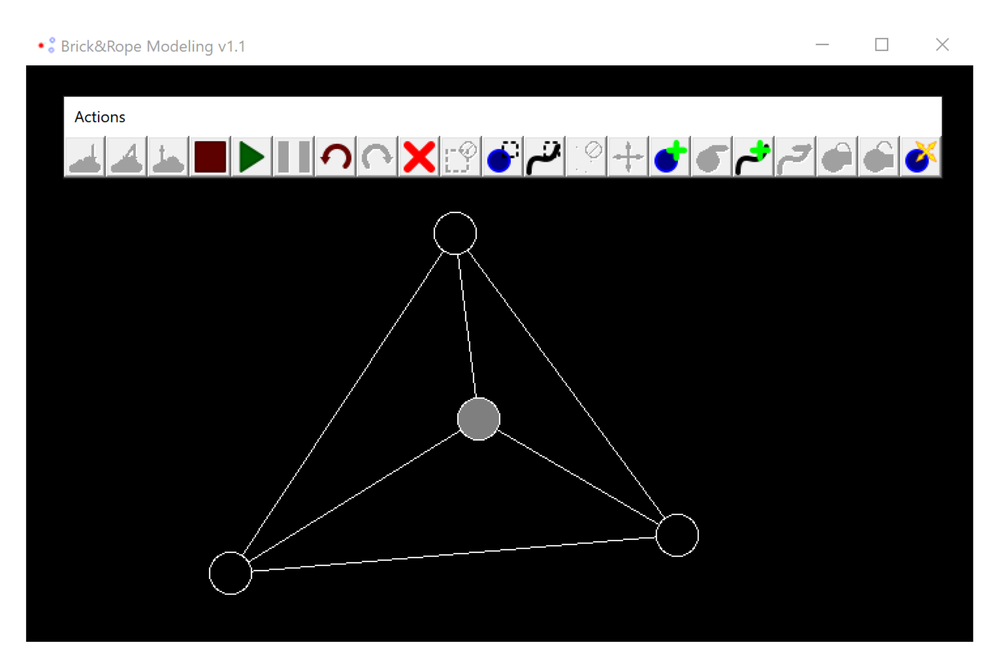
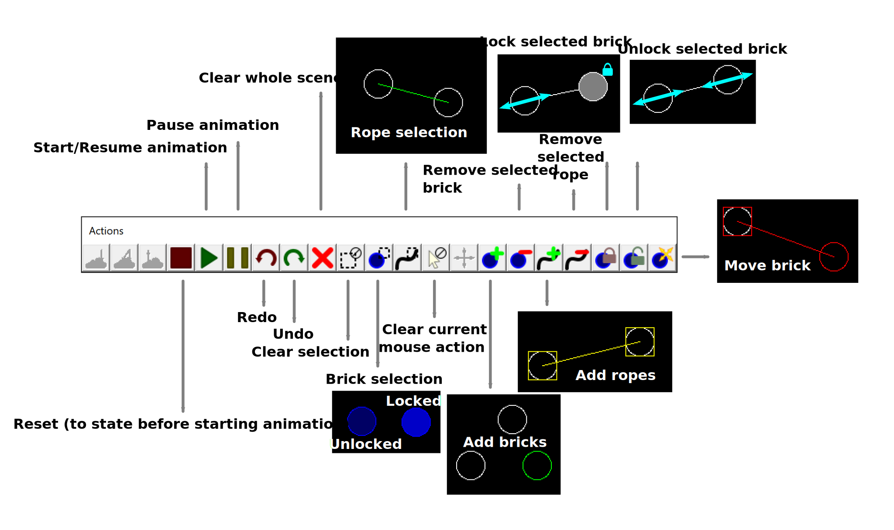

[](https://github.com/landgrafhomyak/itmo-brick7rope-modeling/releases/tag/v1.1)
[](https://github.com/landgrafhomyak/itmo-brick7rope-modeling/releases/tag/v1.1)
[](https://github.com/landgrafhomyak/itmo-brick7rope-modeling/actions/workflows/build.yml)


## Brick&Rope Modeling

Editor for modeling interaction of bricks and elastic ropes.
Bricks have [mass](https://en.wikipedia.org/wiki/Mass); Ropes have [young's module](https://en.wikipedia.org/wiki/Young%27s_modulus), cross-sectional square and undeformed length.

### **CONSUMES A LOT OF CPU RESOURCES**

Abilities:
- [x] Managing scene objects
- [x] Pause
- [x] Thread-separated render, engine and windows manager
- [x] Undo stack
- [ ] Configuring scene objects
- [ ] Saving and loading captures
- [ ] Configuring UPD, FPS and TPS limits

### Requirements
- ~~Windows Vista~~ (Not tested)
- Windows 7 or later

For building:
- Windows SDK
- [CMake](https://cmake.org/) 3.5 or later
- MSVC or MinGW compiler with standards `C99` and `C++11`

### Using




### Installing 
Download executable from [release page](https://github.com/landgrafhomyak/itmo-brick7rope-modeling/releases/tag/v1.1) or build via cmake:
```shell
# Requires administrator privileges
cmake -B ./build -DCMAKE_BUILD_TYPE=Release
cmake --build ./build --config Release
cmake --install ./build

# Custom installation folder:
cmake --install ./build --prefix PATH/TO/FOLDER
```